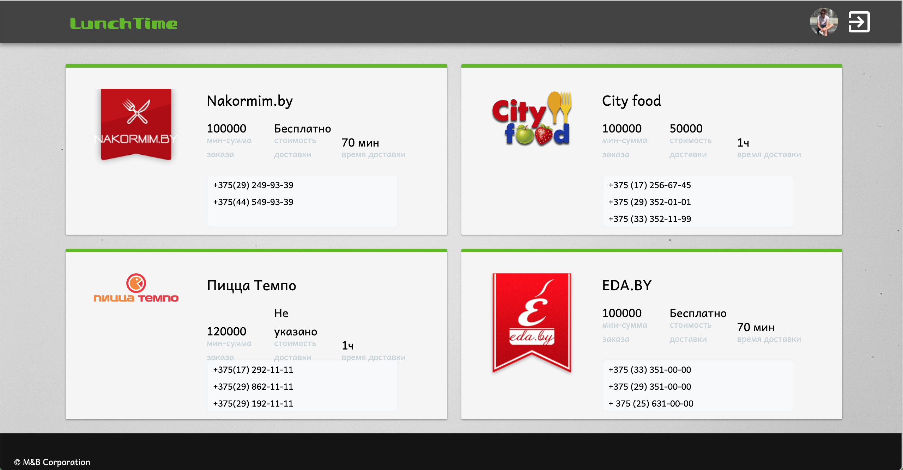

### Description
LunchTime is a service that allows you to order food directly from the app. 
You no longer need to go through a large number of sites to search for food, just choose what you want to eat and click the order button.


What you can do with LunchTime:
#### Select the food order service you are interested in


#### Choose your favorite dish


#### Conveniently control all your orders


#### Discuss an order with someone else


### Installation

```bash
# MongoDB install:
brew install mongodb  # MacOS 
apt install mongodb   # Ubuntu
```

### Project preparing

```bash 
# Start MongoDB server
brew services start mongodb  # MacOS
apt service start mongodb    # Ubuntu

# Install project libraries
npm install

# Fill seed services data
gulp seedServices

# Parse and fill food items
gulp parse
```

### Server starting
```bash
node server.js
```
